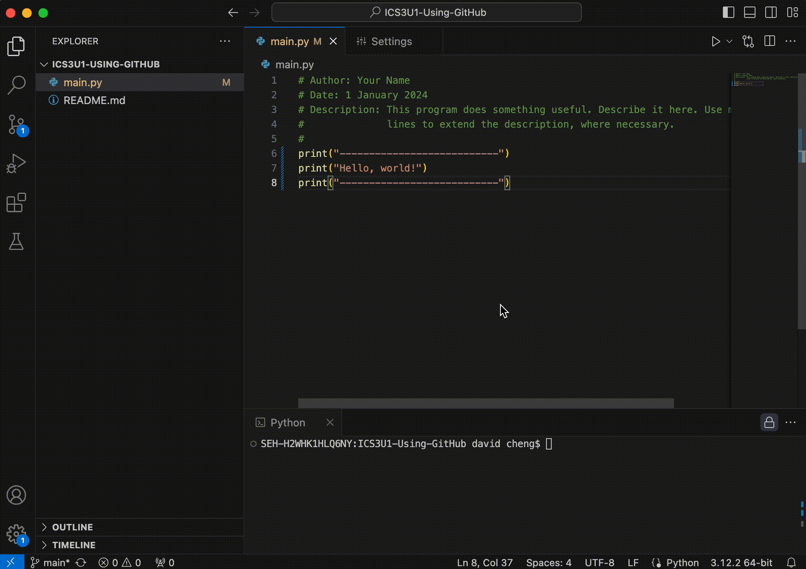
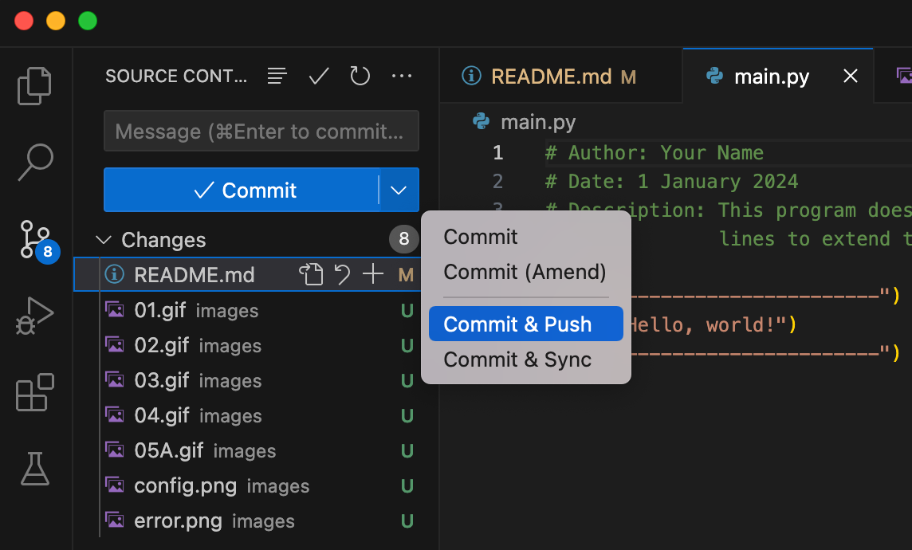
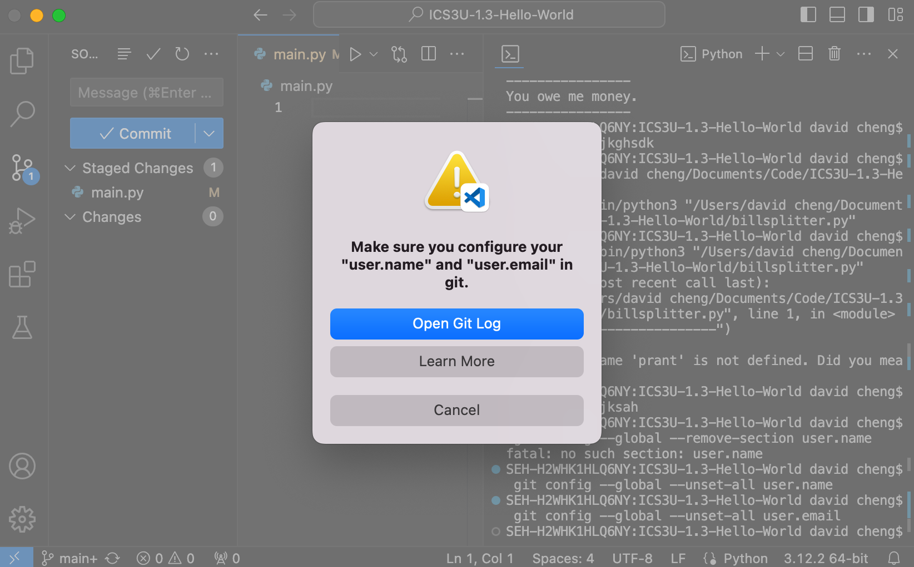
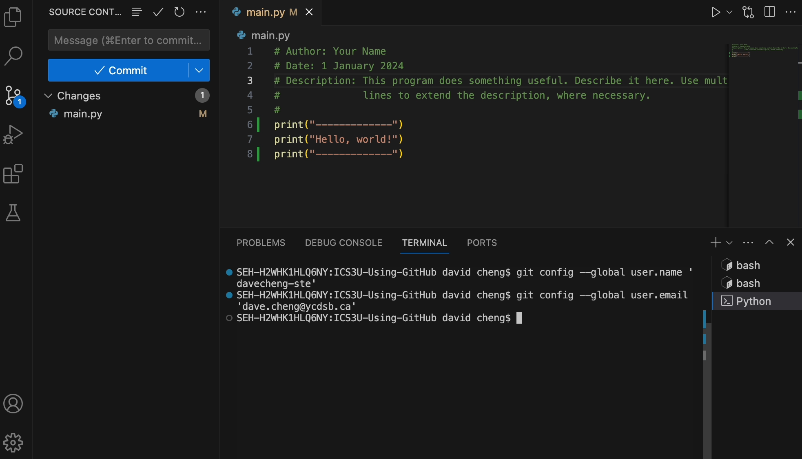
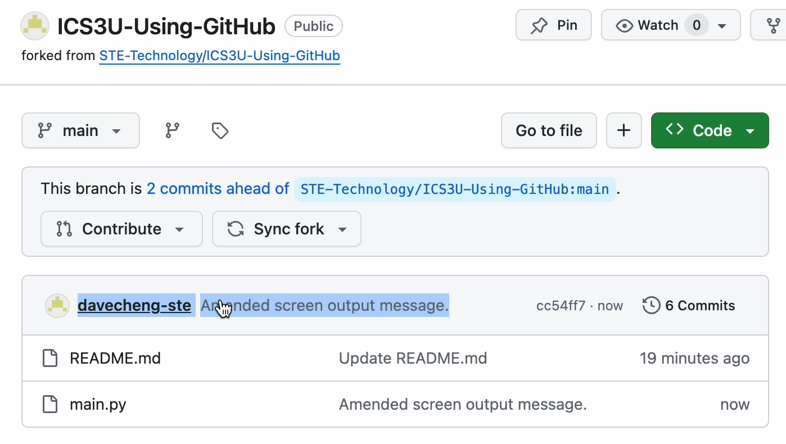

# Forking, Cloning, and Running Code with GitHub

These are instructions on how to fork, clone, and run code from a GitHub repository. Before proceeding, make sure that you have the following setup:

- Your [local development environment](https://docs.google.com/document/d/140jEi-QY2gCjiQ8Qbi7BuEOaEHQ6UFc0riZlkPmict4/edit?usp=sharing) properly set up with Visual Studio Code, Python, and Git installed.
- An account on GitHub set up with your @ycdsbk12.ca account.
- Your GitHub username and email address.

## 1. Fork the repository
Create a fork of the template repository (or "repo"). This will make a copy of the repo in your own personal GitHub account.


## 2. Clone your repository to Visual Studio Code
Cloning your repo to Visual Studio Code creates a local, offline copy on your machine. To do this, follow these steps:

- From the GitHub page for the repo, copy the URL for your fork to the clipboard:


- Next, open Visual Studio Code. Go to **File** > **New Window** in the menu bar.
- In the new Visual Studio Code window, click on **Clone Git Repository**.
- Paste the URL from the clipboard into the prompt and press return.
- You'll be asked where you want to save this cloned folder. (In the example below, I've chosen my *Documents* folder.)
- Open your cloned repository.


## 3. Edit your code
The Explorer sidebar on the left shows all of the files in the current repo. Begin editing your code by opening the appropriate file in the code editor:


## 4. Run your code
Click on the *Run* icon in the top-right corner of the code editor to run your code. A terminal window will appear with your output.

NOTE: Try not to confuse the terminal's command prompt with the actual code output. The command prompt will usually have the hostname of your machine and your username.



## 5. Commit and sync your changes to GitHub
When you are finished editing your code, you will want to Sync or Push your changes back to GitHub online. 




- **Commit**: This action records changes to the local repository. When you commit changes, you are creating a *checkpoint* with a message describing the changes made.
- **Push**: This action uploads the committed changes from your local repository to the remote repository on GitHub.
- **Pull**: This action downloads any new changes from the remote repository since the last sync or clone. New changes are merged with your local repository, warning you of any conflicts.
- **Sync**: This action is combination of all of the above. A *Sync* action will commit and push local changes to the remote repo, as well as pull any new changes from the remote repository.

### Fixing the GitHub configuration error
When you try to do your first GitHub commit in Visual Studio Code, you will likely get a GitHub configuration error like this:



To fix this, enter the following two commands into the terminal, replacing `your_github_username` and `your_github_account_email` with your own:

```shell
git config --global user.name 'your_github_username'
```
and
```shell
git config --global user.email 'your_github_account_email'
```

For example, my personal setup would look like:

```shell
git config --global user.name 'davecheng-ste'
git config --global user.email 'dave.cheng@ycdsb.ca'
```

And entered into the terminal, it looks like:



Next, try to run the Commit and Sync actions again. This setup should only be necessary on your first time. 

Finally, you can check the repository online to verify that your latest Commit changes are reflected:

